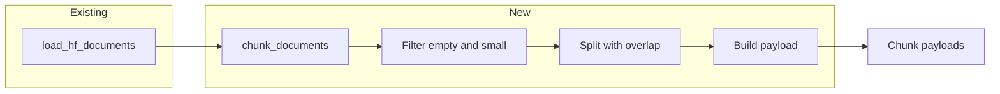

# Chunking pipeline (Step 2)

## Scope

- **In scope:** `src/ingestion/chunking.py`, script test mode (first 20 docs, sample output), payload shape matching [docs/DATA_SCHEMA.md](docs/DATA_SCHEMA.md).
- **Out of scope:** Embedding, Qdrant, any change to loaders or Step 3/4 code.

## Data flow

- **Input:** Same document dicts as today: `doc_id`, `text`, `source_ref`, `doc_type`, `doc_title`, `doc_date` from [src/ingestion/loaders.py](src/ingestion/loaders.py).
- **Output:** List or generator of chunk payload dicts with every field required by the schema (no vectors).

## Payload shape (from DATA_SCHEMA)

Each chunk object must include:

| Field           | Source                                                |
| --------------- | ----------------------------------------------------- |
| doc_id          | From document                                         |
| chunk_id        | Generated: `{doc_id}:{chunk_index}` (stable, unique)  |
| text            | Chunk substring                                       |
| chunk_index     | 0-based index within doc                              |
| page            | `None`                                                |
| source_ref      | From document                                         |
| doc_date        | From document (can be None)                           |
| doc_type        | From document                                         |
| doc_title       | From document                                         |
| image_refs      | `[]`                                                  |
| entity_mentions | `[]`                                                  |
| ingested_at     | `datetime.utcnow().isoformat() + "Z"` (ISO timestamp) |

## Implementation plan

### 1. Token-based splitting (~600–800 tokens, overlap)

- **Size:** Target ~700 tokens per chunk, configurable (e.g. `chunk_size=700`, `overlap=100` in tokens). Allow override via parameters so tests can use smaller values.
- **Tokenizer:** Use the same model family as embedding (BGE) so chunk boundaries align with the future embedding step. Use `transformers.AutoTokenizer.from_pretrained("BAAI/bge-base-en-v1.5")` for token counting only (no model load). Adds `transformers` and `tokenizers` to [requirements.txt](requirements.txt).
- **Overlap:** Sliding window: move forward by `(chunk_size - overlap)` tokens so consecutive chunks share `overlap` tokens. Decode token slices back to text for the `text` field (no requirement to split on sentence boundaries in this step; optional later refinement).
- **Edge cases:** Doc with 0 tokens after filtering → yield no chunks. Doc with &lt; chunk_size tokens → one chunk with full text.

### 2. Filtering (before splitting)

- **Skip doc if:** `text` is empty (after strip) **or** `len(text.strip()) < 50`.
- Apply in the chunking function so the loader stays unchanged; chunker yields zero chunks for filtered docs.

### 3. Module API

- **Function:** `chunk_documents(documents, chunk_size=700, overlap=100, min_doc_chars=50)`.
  - `documents`: iterable of doc dicts (loader output).
  - Return: generator yielding chunk payload dicts (schema fields only).
- **Lazy:** Consume loader in a single pass; yield chunks per doc so memory stays bounded for large runs.

### 4. Files to add/change

- **Add** [src/ingestion/chunking.py](src/ingestion/chunking.py):
  - Load BGE tokenizer once (module-level or lazy) for tokenization/counting.
  - Filter: skip doc if not `text` or `len(text.strip()) < min_doc_chars`.
  - Split: tokenize doc text, slice in windows of `chunk_size` with `overlap`, decode each slice to string.
  - Build payload: for each slice set `chunk_id = f"{doc_id}:{chunk_index}"`, `ingested_at` now in ISO, `page=None`, `image_refs=[]`, `entity_mentions=[]`; copy doc_id, source_ref, doc_date, doc_type, doc_title from doc.
- **Update** [src/ingestion/**init**.py](src/ingestion/__init__.py): export `chunk_documents` (and keep `load_hf_documents`).
- **Update** [scripts/run_ingestion.py](scripts/run_ingestion.py) for test mode:
  - When running in “chunking test” mode (e.g. env var or `--chunk-test` flag): load first 20 docs → pass to `chunk_documents` → print total chunk count and a few sample chunks (first 2–3 chunks of first doc that has chunks), including full metadata keys and example values. No Qdrant, no embedding.
  - Keep existing “loader only” behavior when not in chunk-test mode so Step 1 behavior is unchanged.
- **Update** [requirements.txt](requirements.txt): add `transformers` and `tokenizers` (or rely on `transformers` pulling tokenizers).

### 5. Test mode behavior (acceptance)

- Run: e.g. `python scripts/run_ingestion.py --chunk-test` (or equivalent).
- Script (1) loads first 20 docs, (2) runs chunker with e.g. `chunk_size=700`, `overlap=100`, `min_doc_chars=50`, (3) prints:
  - Total chunks produced.
  - For the first 2–3 chunks (from first doc that yields chunks): full chunk dict (or pretty-printed keys + truncated text + full metadata) so you can confirm schema and structure.
- Stops after chunking; no embedding or DB. Ready for your review.

## Design choices

- **chunk_id:** `{doc_id}:{chunk_index}` keeps IDs unique and deterministic for idempotent indexing later.
- **Tokenizer:** BGE tokenizer keeps chunk sizes aligned with the future embedding model and avoids a second dependency (e.g. tiktoken).
- **Overlap in tokens:** Overlap is in token space so it’s consistent across languages and tokenizer behavior.

## What we do not do

- No embedding, no Qdrant, no new API routes.
- No NER (entity_mentions stay `[]`).
- No sentence-boundary splitting in this step (optional later).

